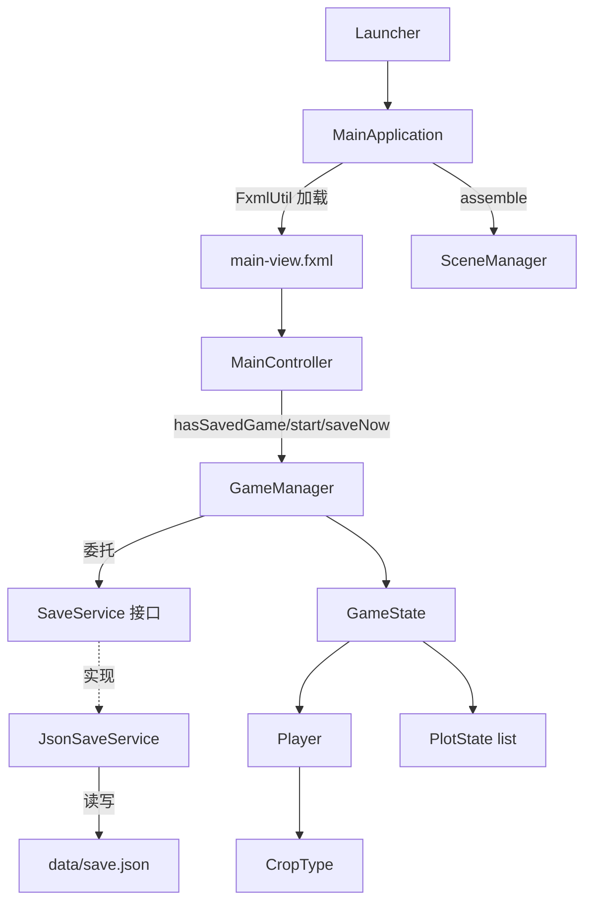
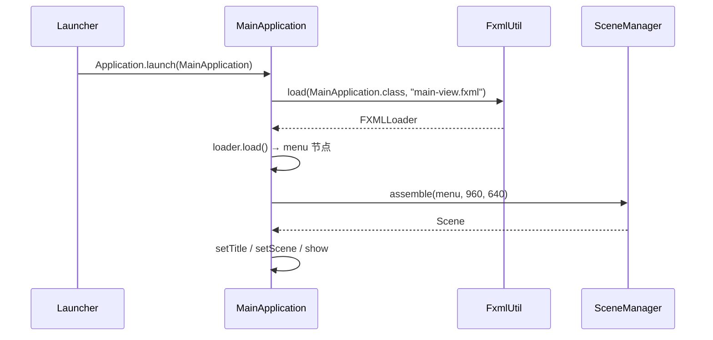
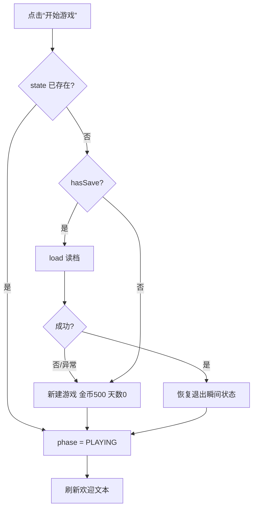

P0 详细设计文档

## 1 文档说明

### 1.1 目的

本文档描述 E 模块（存档与引擎骨架）在 P0 阶段的**详细设计**：类结构、字段与方法签名、
关键流程、数据格式、状态机、异常边界与测试设计。面向：

- E 模块开发者（实现/维护存档与引擎骨架）；
- 与 E 交互的 A/B/C/D 模块开发者（明确挂载点与存档字段契约）；
- 验收者（对照《FSF_P0-P4功能实现与验收规范》核查 E 行条目）。

### 1.2 范围（P0 已实现内容）

| 能力          | 是否 P0      | 说明                                         |
| ----------- | ---------- | ------------------------------------------ |
| 全局入口单例      | 是          | `GameManager.getInstance()`                |
| 游戏状态机       | 是          | MAIN_MENU / PLAYING / PAUSED / EXITING     |
| JSON 临时存档   | 是          | `JsonSaveService`，落盘 `data/save.json`      |
| 场景组装骨架      | 是          | `SceneManager`（BorderPane 五区）              |
| 主界面与开始/保存按钮 | 是          | `main-view.fxml` + `MainController`        |
| 退出自动存档      | 是          | `MainApplication.stop()` → `saveAndExit()` |
| SQLite 正式存档 | 否（P1）      | 由 `SqliteSaveService` 替换实现                 |
| 离线成长模拟      | 否（P2）      | 读档仅恢复退出瞬间状态                                |
| 经济/土地/天气/时钟 | 否（A/B/C/D） | E 只提供装配点，不越层实现                             |

### 1.3 依据

- 验收规范 §三十九 ~ §四十三（存档相关验收条目）；
- B 模块 §6.2 / §9 / §10（唯一种子库存、初始金币）；
- 脚手架 §七（manager 包）、§九（运行数据 `data/`）；
- 仓库源码（本文所有字段、签名、文案均与源码一致）。

### 1.4 术语

| 术语       | 含义                                   |
| -------- | ------------------------------------ |
| 状态快照     | `GameState`，仅表达“现在是什么状态”，不含任何计算      |
| 唯一种子库存   | `Player.seedInventory`，禁止在别处再存一份     |
| 阶段 Phase | `GamePhase` 枚举，游戏生命周期阶段              |
| 槽位 Slot  | `SceneManager.Slot`，BorderPane 的五个区域 |
| 世界时间     | `currentWorldTime`，ISO-8601 字符串      |

### 1.5 与现有文档的关系

本文是**实现级**设计文档，补充而非替代：

- 《E模块-状态机图.md》（`docs/`）：状态机图示；
- 《接口约定-场景合并.md》（`docs/`）：场景挂载约定；
- 《接口要求清单-队友对接.md》（`docs/`）：跨模块接口清单。

> 注意：《接口约定-场景合并.md》§4 仍写作 `version = 1`，而当前代码为
> `SAVE_VERSION = 2`，存在文档滞后，以本文（及源码）为准。

---

## 2 模块概述

### 2.1 职责

E 模块承担两类职责：

1. **存档（Persistence）**：把 `GameState` 序列化为 JSON 并落盘、读回、版本兼容与容错。
2. **引擎骨架（Engine Skeleton）**：全局入口单例、游戏状态机、场景组装、启动与退出生命周期。

### 2.2 边界（E 不做什么）

- 不实现经济、土地、作物成长、天气、时钟等业务计算（属 A/B/C/D）；
- 不保存“推导得出的值”，只保存状态本身（统一 Model 原则）；
- Controller 不得感知存档文件路径（验收 §三十九），路径知识封闭在 `JsonSaveService`；
- 读档不做离线成长（P2 才引入）。

### 2.3 在整体架构中的位置



---

## 3 结构设计

### 3.1 包结构

```
com.fieldstory.farm
├── Launcher.java                 启动器（与 Application 分离）
├── config/AppConfig.java         全局配置常量
├── controller/MainController.java 主界面控制器
├── manager/
│   ├── GameManager.java          游戏管理器（单例 + 状态机 + 生命周期）
│   ├── GamePhase.java            状态机阶段枚举
│   └── SceneManager.java         场景组装管理器（单例）
├── model/
│   ├── GameState.java            存档聚合根
│   ├── Player.java               玩家（金币 + 唯一种子库存）
│   ├── PlotState.java            单块土地状态快照
│   └── CropType.java             作物类型枚举（含经济参数）
├── persistence/JsonSaveService.java  P0 JSON 存档实现
├── service/SaveService.java      存档服务接口
├── util/
│   ├── FxmlUtil.java             FXML 加载工具
│   └── GameConstants.java        全局游戏常量
└── view/MainApplication.java     JavaFX 应用入口
```

### 3.2 类清单

| 类/接口              | 层    | 角色                   | 实例化方式        |
| ----------------- | ---- | -------------------- | ------------ |
| `Launcher`        | 入口   | 启动桥接                 | `main()`     |
| `MainApplication` | 视图   | JavaFX `Application` | JavaFX 反射    |
| `MainController`  | 控制器  | FXML 控制器             | `FXMLLoader` |
| `GameManager`     | 管理器  | 全局单例（可注入测试）          | 双检锁单例 / 构造器  |
| `GamePhase`       | 枚举   | 阶段                   | —            |
| `SceneManager`    | 管理器  | 场景组装单例               | 双检锁单例        |
| `SaveService`     | 服务接口 | 存档抽象                 | —            |
| `JsonSaveService` | 持久化  | JSON 实现              | 构造器          |
| `GameState`       | 模型   | 存档聚合                 | 构造器          |
| `Player`          | 模型   | 玩家                   | 构造器          |
| `PlotState`       | 模型   | 土地快照                 | 构造器          |
| `CropType`        | 枚举   | 作物参数                 | —            |
| `GameConstants`   | 工具   | 常量                   | 静态           |
| `AppConfig`       | 配置   | UI/FXML 常量           | 静态           |
| `FxmlUtil`        | 工具   | FXML 加载              | 静态           |

### 3.3 依赖方向

- 单向依赖：`view → manager/service/persistence → model → (无跨模块类型)`。
- `model` 不依赖任何 A/B/C/D 类型；土地/作物以**字符串**保存（见 §6.3）。
- `SaveService` 为接口，`GameManager` 仅依赖接口，便于测试注入与 P1 替换。

---

## 4 类详细设计

### 4.1 `Launcher`

| 项   | 内容                                         |
| --- | ------------------------------------------ |
| 包   | `com.fieldstory.farm`                      |
| 职责  | 启动器：与 `Application` 分离，保证模块化/非模块化环境下均可直接运行 |

```java
public class Launcher {
    public static void main(String[] args) {
        Application.launch(MainApplication.class, args);
    }
}
```

### 4.2 `MainApplication`（extends `javafx.application.Application`）

**start(Stage)**

1. `FxmlUtil.load(this.getClass(), AppConfig.MAIN_VIEW_FXML).load()` 加载主菜单节点；
2. `SceneManager.getInstance().assemble(menu, 960.0, 640.0)` 组装主场景；
3. 设置标题 `AppConfig.APP_TITLE`、`stage.setScene(scene)`、`stage.show()`。

**stop()**

```java
@Override
public void stop() {
    GameManager.getInstance().saveAndExit();
}
```

> `stop()` 是**退出自动存档**的唯一触发点（验收 §四十二）。

### 4.3 `SceneManager`

- 单例：`private static volatile SceneManager instance` + 双检锁；构造器私有。
- 内部枚举 `Slot`：`TOP / CENTER / LEFT / RIGHT / BOTTOM`。
- 字段：`Map<Slot, Node> mounted = new EnumMap<>(Slot.class)`；`BorderPane root`。

| 方法   | 签名                                                    | 行为                                                    |
| ---- | ----------------------------------------------------- | ----------------------------------------------------- |
| 获取单例 | `static SceneManager getInstance()`                   | 双检锁                                                   |
| 组装   | `Scene assemble(Node centerNode, double w, double h)` | 新建 `BorderPane`、`mounted.clear()`、挂 CENTER、返回 `Scene` |
| 挂载   | `void mount(Slot slot, Node node)`                    | 写入 map 并 `apply(slot)`                                |
| 卸载   | `Node unmount(Slot slot)`                             | 移除并 `apply(slot)`，返回被移除节点                             |
| 取根   | `BorderPane root()`                                   | 未组装返回 `null`                                          |
| 应用   | `private void apply(Slot slot)`                       | `root==null` 时直接返回；否则按槽位 `setTop/setCenter/...`       |

**注意事项**

- `assembly` 前调用 `mount` 会写入 map，但 `apply()` 因 `root==null` 空转；
  随后 `assemble()` 会 `mounted.clear()`，**丢弃装配前的挂载**。
- `mount` 同槽位重复挂载为**替换**语义。

### 4.4 `GameManager`

- 单例：`private static volatile GameManager instance` + 双检锁。
- 字段：`final SaveService saveService`、`GameState state`、`GamePhase phase`。
- 常量：`INITIAL_GOLD = GameConstants.INITIAL_GOLD`（兼容别名，值 500）；
  `DEFAULT_PLAYER_NAME = "农夫"`。

**构造器**

```java
public GameManager(SaveService saveService) {
    this.saveService = Objects.requireNonNull(saveService, "SaveService 不能为空");
    this.phase = GamePhase.MAIN_MENU;
}
```

**方法**

| 方法   | 签名                                 | 行为                                        | 异常                                                             |
| ---- | ---------------------------------- | ----------------------------------------- | -------------------------------------------------------------- |
| 单例   | `static GameManager getInstance()` | 默认 `new JsonSaveService()`                | —                                                              |
| 当前阶段 | `GamePhase currentPhase()`         | 返回 `phase`                                | —                                                              |
| 当前状态 | `GameState currentState()`         | 返回 `state`                                | `state==null` → `IllegalStateException("游戏尚未启动，请先调用 start()")` |
| 有存档  | `boolean hasSavedGame()`           | 委托 `saveService.hasSave()`                | —                                                              |
| 开始   | `GameState start()`                | 见下                                        | 不抛（内部降级）                                                       |
| 新会话  | `GameState startNewGame()`         | `state=newGame()`，`phase=PLAYING`         | —                                                              |
| 新状态  | `static GameState newGame()`       | `new GameState(new Player("农夫",500), 0L)` | —                                                              |
| 手动存  | `void saveNow()`                   | 委托 `saveService.save(state)`              | `state==null` → `IllegalStateException("游戏尚未启动，无法保存")`         |
| 存并退出 | `void saveAndExit()`               | 见下                                        | 不抛                                                             |
| 暂停   | `void pause()`                     | 仅 PLAYING 可暂停                             | 非 PLAYING → `IllegalStateException("仅游戏中可暂停（当前阶段: X）")`        |
| 恢复   | `void resume()`                    | 仅 PAUSED 可恢复                              | 非 PAUSED → `IllegalStateException("仅暂停中可恢复（当前阶段: X）")`         |

**`start()` 逻辑**

```java
if (state == null) {
    if (saveService.hasSave()) {
        try { state = saveService.load(); }
        catch (IllegalStateException e) {
            System.err.println("[GameManager] 存档不可用，将新建游戏: " + e.getMessage());
            state = null;
        }
    }
    if (state == null) { state = newGame(); }   // 无档/损坏/版本不符 → 新档
}
phase = GamePhase.PLAYING;
return state;
```

> 关键点：`start()` **幂等**——`state != null` 时直接复用当前会话，不重复读档。

**`saveAndExit()` 逻辑**

```java
if (state != null && (phase == GamePhase.PLAYING || phase == GamePhase.PAUSED)) {
    saveService.save(state);
}
phase = GamePhase.EXITING;
```

> 注意：未开始游戏（`state==null`）时调用 `saveAndExit()` **不保存也不抛异常**，仅置 `EXITING`。

---

### 4.5 `SaveService`（接口）

```java
public interface SaveService {
    boolean hasSave();
    void save(GameState state);
    GameState load();   // 不存在存档时返回 null
}
```

- P0 由 `JsonSaveService` 实现；P1 由 `SqliteSaveService` 替换，业务层调用方式不变。
- Controller 不得感知存档文件位置（验收 §三十九）。

### 4.6 `JsonSaveService`（implements `SaveService`）

**常量**

| 常量                      | 值                  | 说明                                   |
| ----------------------- | ------------------ | ------------------------------------ |
| `SAVE_VERSION`          | `2`                | 当前结构版本（v2 新增 `player.seedInventory`） |
| `MIN_SUPPORTED_VERSION` | `1`                | 可读入的最低版本                             |
| `SCHEMA`                | `"P0-json"`        | 格式标识（区分 P1 SQLite）                   |
| `DEFAULT_SAVE_FILE`     | `"data/save.json"` | 默认存档路径（相对运行目录）                       |

**字段**

- `private final ObjectMapper mapper = new ObjectMapper();`
- `private final Path saveFile;`

**构造器**

| 构造器                              | 行为                                                   |
| -------------------------------- | ---------------------------------------------------- |
| `JsonSaveService()`              | `this(Paths.get(DEFAULT_SAVE_FILE))`                 |
| `JsonSaveService(Path saveFile)` | `null` → `IllegalArgumentException("saveFile 不能为空")` |

**方法**

| 方法                     | 行为                              | 异常/返回值                                                                                                             |
| ---------------------- | ------------------------------- | ------------------------------------------------------------------------------------------------------------------ |
| `Path getSaveFile()`   | 返回存档路径                          | 供测试与 P1 迁移                                                                                                         |
| `boolean hasSave()`    | `Files.isRegularFile(saveFile)` | —                                                                                                                  |
| `void save(GameState)` | 建父目录 → 美化 JSON → UTF-8 写盘       | `state==null`→`IllegalArgumentException("GameState 不能为空")`；`IOException`→`IllegalStateException("存档写入失败: <绝对路径>")` |
| `GameState load()`     | 读文件 → `toGameState`             | 无存档→`null`；`IOException`→`IllegalStateException("存档文件损坏或无法读取: <绝对路径>")`                                            |

**`toRoot(GameState)` — 序列化顺序**

```
version(=2) → schema → savedAt(=LocalDateTime.now()) → gameDay
→ currentWorldTime(可为 null) → player{name,gold,seedInventory} → unlocked[] → plots[]
```

- `toSeedInventoryNode`：键为 `CropType.name()`（WHEAT/CORN/CARROT），值为数量（`null`→`0`）；
- `toPlotNode`：`plotId` 为空/空白时按 `"row,column"` 生成；有作物才写 `crop` 对象，否则 `crop = null`。

**`toGameState(JsonNode)` — 反序列化**

1. `root` 为空或非对象 → `IllegalStateException("存档文件为空或不是 JSON 对象")`；
2. 版本校验：`path("version").asInt(-1)`，若 `< MIN_SUPPORTED_VERSION` 或 `> SAVE_VERSION`
   → `IllegalStateException("存档版本不兼容: 支持 version=1~2，实际 version=X")`；
3. `player` 节点存在且为对象时构造 `Player(name, gold)` 并设置种子库存；否则 `player` 保持 `null`；
4. 依次读取 `gameDay`、`currentWorldTime`（仅文本）、`unlocked`（仅文本项）、`plots`（仅对象项）。

**种子库存读取 `readSeedInventory(playerNode, root)`**

- 优先取 `player.seedInventory`（v2 正式位置）；
- 缺失时回退根节点 `seedInventory`（兼容早期 v2 快照）；
- 两者都无 → 空库存（兼容 v1 旧档）；
- 未知作物名经 `parseCropType` 返回 `null` 被**跳过**（前向兼容，不崩溃）。

**`savedAt` 设计说明**

`savedAt` 仅**写入**，`toGameState` 未回读，`GameState` 也无对应字段——即“保存时间”
目前不参与恢复。如需展示“上次保存于…”，需在 `GameState` 增加字段。

---

### 4.7 `GamePhase`（枚举）

| 常量          | 含义         |
| ----------- | ---------- |
| `MAIN_MENU` | 主菜单：尚未开始游戏 |
| `PLAYING`   | 游戏中        |
| `PAUSED`    | 暂停         |
| `EXITING`   | 退出（已保存并关闭） |

### 4.8 `GameState`（存档聚合根）

| 字段                 | 类型                      | 说明                               |
| ------------------ | ----------------------- | -------------------------------- |
| `player`           | `Player`                | 玩家（唯一持有种子库存）                     |
| `gameDay`          | `long`                  | 游戏天数，对应 `GameClock.getGameDay()` |
| `currentWorldTime` | `String`                | 存档时刻世界时间（ISO-8601，可为 `null`）     |
| `unlocked`         | `final Set<String>`     | 已解锁内容标识（`LinkedHashSet`，保序）      |
| `plots`            | `final List<PlotState>` | 全部土地快照（`ArrayList`）              |

- 构造器：`GameState()` → `this(null, 0L)`；`GameState(Player, long)`。
- 全部字段提供 getter；`player/gameDay/currentWorldTime` 提供 setter。
- `unlocked`、`plots` 仅暴露集合本身（调用方通过 `getUnlocked().add(...)` 修改）。
- **不含任何计算逻辑**（统一 Model 原则）。

### 4.9 `Player`

| 字段              | 类型                      | 说明                              |
| --------------- | ----------------------- | ------------------------------- |
| `name`          | `String`                | 玩家姓名                            |
| `gold`          | `int`                   | 金币                              |
| `seedInventory` | `Map<CropType,Integer>` | **唯一种子库存**，`EnumMap`，恒不为 `null` |

- 构造器：`Player()` → `this("农夫", 100)`（**占位默认值**）；`Player(String, int)`。
- `getSeedInventory()` 恒非 `null`；`setSeedInventory(Map)` 传 `null` 时重置为空库存，
  仅供状态恢复/序列化，业务变更应经 B 的 `EconomyService`。
- **新档勿直接 `new Player()`**（金币为 100）；新游戏统一走
  `GameManager.newGame()` / `start()`（金币 500）。

### 4.10 `PlotState`

| 字段                       | 类型       | 说明                            |
| ------------------------ | -------- | ----------------------------- |
| `plotId`                 | `String` | 格子标识；为空时序列化按 `row,column` 生成  |
| `row` / `column`         | `int`    | 坐标（0-based）                   |
| `state`                  | `String` | 土地状态名（如 EMPTY/TILLED/GROWING） |
| `cropUuid`               | `String` | 作物唯一标识                        |
| `cropType`               | `String` | 作物类型名（WHEAT/CORN/CARROT…）     |
| `growthStage`            | `String` | 成长阶段名                         |
| `growthProgress`         | `double` | 成长进度（0.0~1.0）                 |
| `plantWorldTime`         | `String` | 播种时刻世界时间（ISO-8601）            |
| `manualWaterCount`       | `int`    | 主动浇水次数                        |
| `lastManualWaterGameDay` | `String` | 最近一次主动浇水的游戏日                  |

- `hasCrop()` ⇔ `cropUuid != null`。
- `state/cropType/growthStage` 以**字符串**保存，避免在 A 模型交付前形成跨模块类型依赖；
  A 接入后由适配层做“枚举 ↔ 字符串”映射。

> **D14 约定（跨模块决议：时间类型与浇水哨兵）**：A 侧时间字段统一 `long`——
> `plantWorldTime` 为**游戏小时**（`GameClock.getGameDay()×24 + getGameHour()`），
> `lastManualWaterGameDay` 为**游戏日**（原 `int` 拓宽）；`BasicCrop` 字段默认 `-1` 哨兵
> （模型层兜底），`CropFactory` 显式设置。E 当前仍以**字符串**存取这两个字段（见上表），
> 接入时由适配层负责 `long ↔ 字符串` 换算，且**反序列化“无浇水记录”必须映射 `-1`**；
> D 的 `GameClock` 无需新增 `getWorldTime()`。详见 A 设计文档 §8.4/§9。

### 4.11 `CropType`（枚举）

| 常量       | 基础生长天数 | 种子价 | 基础售价 |
| -------- | ------ | --- | ---- |
| `WHEAT`  | 2      | 10  | 50   |
| `CORN`   | 3      | 15  | 70   |
| `CARROT` | 4      | 20  | 60   |

- `getBaseDailyProgress()` = `100.0 / baseGrowthDays`（验收 §二十三）。

### 4.12 `GameConstants`

| 分组    | 常量                                                                                                                         |
| ----- | -------------------------------------------------------------------------------------------------------------------------- |
| 地图布局  | `MAP_ROWS=12`、`MAP_COLS=12`、`CENTER_START_ROW=2`、`CENTER_END_ROW=9`、`CENTER_START_COL=2`、`CENTER_END_COL=9`、`TILE_SIZE=64` |
| 时间    | `MINUTES_PER_TICK=10`、`MINUTES_PER_DAY=1440`、`DAY_START=360`(06:00)、`DAY_END=1080`(18:00)                                  |
| 经济    | `INITIAL_GOLD=500`、`TILL_COST=5`                                                                                           |
| P0 倍率 | `WEATHER_RATE_P0=1.0`、`DECORATION_RATE_P0=1.0`、`EVENT_RATE_P0=1.0`                                                         |

### 4.13 `AppConfig`

`APP_TITLE="FieldStoryFarm"`、`WINDOW_WIDTH=960`、`WINDOW_HEIGHT=640`、
`MAIN_VIEW_FXML="main-view.fxml"`；私有构造，禁止实例化。

### 4.14 `FxmlUtil`

```java
public static FXMLLoader load(Class<?> controllerClass, String fxmlName) throws IOException {
    URL location = controllerClass.getResource(fxmlName);
    if (location == null) throw new IOException("未找到 FXML 资源: " + fxmlName);
    return new FXMLLoader(location);
}
```

### 4.15 `MainController`（FXML 控制器）

- 字段：`@FXML Label welcomeText`；`private final GameManager gameManager = GameManager.getInstance();`
- `initialize()`：`welcomeText.setText("欢迎来到田野故事农场！")`。
- `onStartButtonClick()`：

  ```java
  boolean hasSave = gameManager.hasSavedGame();
  GameState state = gameManager.start();
  Player player = state.getPlayer();
  String gold = (player == null) ? "?" : String.valueOf(player.getGold());
  welcomeText.setText("开始耕种吧！当前金币：%s  游戏天数：%d%s".formatted(
          gold, state.getGameDay(), hasSave ? "（已恢复存档）" : "（新游戏）"));
  ```
- `onSaveButtonClick()`：`try { gameManager.saveNow(); setText("进度已保存！"); }`
  `catch (IllegalStateException e) { setText("尚无进行中的游戏，请先点击“开始游戏”。"); }`

**对应 FXML（`main-view.fxml`）**

```xml
<VBox alignment="CENTER" spacing="20.0" xmlns:fx="http://javafx.com/fxml"
      fx:controller="com.fieldstory.farm.controller.MainController">
    <padding><Insets bottom="20.0" left="20.0" right="20.0" top="20.0"/></padding>
    <Label fx:id="welcomeText"/>
    <Button text="开始游戏" onAction="#onStartButtonClick"/>
    <Button text="保存进度" onAction="#onSaveButtonClick"/>
</VBox>
```

---

## 5 关键流程

### 5.1 应用启动



### 5.2 开始 / 继续游戏（`onStartButtonClick` → `GameManager.start()`）



### 5.3 手动存档（`onSaveButtonClick` → `saveNow()`）

1. `state == null` → 抛 `IllegalStateException`，Controller 捕获并提示“尚无进行中的游戏”；
2. 否则 `saveService.save(state)` 写盘；不改变 `phase`。

### 5.4 退出自动存档（`saveAndExit()`）

| 前置状态             | 是否保存 | 结果阶段      |
| ---------------- | ---- | --------- |
| `PLAYING`        | 是    | `EXITING` |
| `PAUSED`         | 是    | `EXITING` |
| `MAIN_MENU`（未开始） | 否    | `EXITING` |
| `EXITING`        | 否    | `EXITING` |

> 触发链：关闭窗口 → JavaFX `stop()` → `GameManager.saveAndExit()` → `saveService.save()`。

### 5.5 读档与容错

| 情形                       | 行为                                                     |
| ------------------------ | ------------------------------------------------------ |
| 无存档文件                    | `load()` 返回 `null` → 新建游戏                              |
| 文件非 JSON / 损坏            | `load()` 抛 `IllegalStateException` → `start()` 捕获并新建游戏 |
| `version` 缺失             | `asInt(-1)` → 版本不兼容 → 新建游戏                             |
| `version` 超出 1~2         | 版本不兼容 → 新建游戏                                           |
| `player` 缺失              | `state.getPlayer() == null`（UI 显示金币 `?`）               |
| 未知作物名                    | 跳过该键，其余正常读入                                            |
| v1 旧档无 `seedInventory`   | 按空库存读入                                                 |
| 早期 v2 根级 `seedInventory` | 回退读入                                                   |

### 5.6 暂停 / 恢复

- `pause()`：仅 `PLAYING → PAUSED`；否则抛异常。
- `resume()`：仅 `PAUSED → PLAYING`；否则抛异常。

---

## 6 数据设计

### 6.1 存档 JSON 结构（示例）

```json
{
  "version" : 2,
  "schema" : "P0-json",
  "savedAt" : "2026-09-09T08:30:00",
  "gameDay" : 12,
  "currentWorldTime" : "2026-09-09T08:30:00",
  "player" : {
    "name" : "测试农夫",
    "gold" : 888,
    "seedInventory" : { "WHEAT" : 4, "CORN" : 2 }
  },
  "unlocked" : [ "shop", "land-2x2" ],
  "plots" : [ {
    "plotId" : "special-1",
    "row" : 5,
    "column" : 6,
    "state" : "GROWING",
    "crop" : {
      "cropUuid" : "uuid-1",
      "cropType" : "WHEAT",
      "growthStage" : "SPROUT",
      "growthProgress" : 0.35,
      "plantWorldTime" : "2026-09-09T10:00:00",
      "manualWaterCount" : 1,
      "lastManualWaterGameDay" : "2"
    }
  }, {
    "plotId" : "2,2", "row" : 2, "column" : 2, "state" : "EMPTY", "crop" : null
  } ]
}
```

### 6.2 版本与兼容策略

| 版本      | 结构                     | 读取策略          |
| ------- | ---------------------- | ------------- |
| v1      | 根级 / 无 `seedInventory` | 可读；种子库存按空处理   |
| v2      | `player.seedInventory` | 正式位置          |
| （早期 v2） | 根级 `seedInventory`     | 回退读入          |
| > 2     | 未来结构                   | **拒绝**，抛版本不兼容 |

- 升级结构必须递增 `SAVE_VERSION` 并在加载时做兼容；禁止原地改结构。
- P1 迁 SQLite：按版本增量迁移，读旧 JSON 一次性导入。

### 6.3 序列化字段映射

| Java                         | JSON 键                 | 备注                     |
| ---------------------------- | ---------------------- | ---------------------- |
| `GameState.gameDay`          | `gameDay`              | —                      |
| `GameState.currentWorldTime` | `currentWorldTime`     | `null` 写 `null`        |
| `GameState.unlocked`         | `unlocked`             | 数组，跳过 `null` 项         |
| `GameState.plots`            | `plots`                | 数组，跳过 `null` 项         |
| `Player.name/gold`           | `player.name/gold`     | —                      |
| `Player.seedInventory`       | `player.seedInventory` | `CropType.name()` → 数量 |
| `PlotState.*`                | `plots[i].*`           | 见 §4.10                |
| （仅写）                         | `savedAt` / `schema`   | 回读不使用                  |

---

## 7 状态机

**迁移表**

| 当前             | 操作               | 目标      | 条件/异常 |
| -------------- | ---------------- | ------- | ----- |
| MAIN_MENU      | `start()`        | PLAYING | 读档或新建 |
| MAIN_MENU      | `startNewGame()` | PLAYING | 强制新档  |
| MAIN_MENU      | `pause()`        | —       | 抛异常   |
| PLAYING        | `pause()`        | PAUSED  | —     |
| PLAYING        | `resume()`       | —       | 抛异常   |
| PAUSED         | `resume()`       | PLAYING | —     |
| PLAYING/PAUSED | `saveAndExit()`  | EXITING | 先保存   |
| MAIN_MENU      | `saveAndExit()`  | EXITING | 不保存   |
| EXITING        | 任意               | —       | 终态    |

---

## 8 接口清单（对外可见方法）

### 8.1 `GameManager`

| 方法                     | 返回            | 用途             |
| ---------------------- | ------------- | -------------- |
| `static getInstance()` | `GameManager` | 全局唯一入口         |
| `currentPhase()`       | `GamePhase`   | 查询阶段           |
| `currentState()`       | `GameState`   | 查询会话状态（未启动抛异常） |
| `hasSavedGame()`       | `boolean`     | 是否存在可恢复存档      |
| `start()`              | `GameState`   | 开始/继续          |
| `startNewGame()`       | `GameState`   | 强制新档           |
| `static newGame()`     | `GameState`   | 构造新状态          |
| `saveNow()`            | `void`        | 手动存档           |
| `saveAndExit()`        | `void`        | 存并退出           |
| `pause()` / `resume()` | `void`        | 暂停/恢复          |

### 8.2 `SceneManager`

| 方法                               | 返回             | 用途     |
| -------------------------------- | -------------- | ------ |
| `static getInstance()`           | `SceneManager` | 单例     |
| `assemble(Node, double, double)` | `Scene`        | 组装主场景  |
| `mount(Slot, Node)`              | `void`         | 挂载模块视图 |
| `unmount(Slot)`                  | `Node`         | 卸载     |
| `root()`                         | `BorderPane`   | 根布局    |

### 8.3 `SaveService` / `JsonSaveService`

`hasSave()` / `save(GameState)` / `load()`；实现类另有 `getSaveFile()`。
常量：`SAVE_VERSION`、`MIN_SUPPORTED_VERSION`、`SCHEMA`、`DEFAULT_SAVE_FILE`。

---

## 9 异常与边界

### 9.1 异常一览

| 触发点                          | 异常类型                       | 消息                                     |
| ---------------------------- | -------------------------- | -------------------------------------- |
| `GameManager` 构造传 `null` 服务  | `NullPointerException`     | “SaveService 不能为空”                     |
| `currentState()` 未启动         | `IllegalStateException`    | “游戏尚未启动，请先调用 start()”                  |
| `saveNow()` 未启动              | `IllegalStateException`    | “游戏尚未启动，无法保存”                          |
| `pause()` 非 PLAYING          | `IllegalStateException`    | “仅游戏中可暂停（当前阶段: X）”                     |
| `resume()` 非 PAUSED          | `IllegalStateException`    | “仅暂停中可恢复（当前阶段: X）”                     |
| `JsonSaveService` 构造传 `null` | `IllegalArgumentException` | “saveFile 不能为空”                        |
| `save(null)`                 | `IllegalArgumentException` | “GameState 不能为空”                       |
| 写盘 IO 失败                     | `IllegalStateException`    | “存档写入失败: <路径>”                         |
| 读盘 IO 失败                     | `IllegalStateException`    | “存档文件损坏或无法读取: <路径>”                    |
| 根节点为空/非对象                    | `IllegalStateException`    | “存档文件为空或不是 JSON 对象”                    |
| 版本超范围                        | `IllegalStateException`    | “存档版本不兼容: 支持 version=1~2，实际 version=X” |
| `FxmlUtil` 资源缺失              | `IOException`              | “未找到 FXML 资源: <名>”                     |

> **说明**：代码中**不存在数字错误码**。上表以“异常类型 + 固定文案”作为可判定标识。

### 9.2 边界与已知取舍

1. `start()` 捕获 `IllegalStateException` 降级为新档，仅打印到 `stderr`，**不弹窗提示**。
2. `saveAndExit()` 在未开始时静默置 `EXITING`。
3. `mount()` 在 `assemble()` 之前调用会被清空（见 §4.3）。
4. `SceneManager`/`GameManager` 为进程级单例，**多测试用例共享**；单例相关测试须谨慎。
5. `savedAt` 只写不读（§4.6）。
6. `Player` 无参构造金币为 100（占位），勿用于新档。

---

## 10 测试设计

测试位于 `src/test/java`，共 **21** 个用例（JUnit 5 + `@TempDir` 隔离存档）。

### 10.1 `GameManagerTest`（8）

| 用例                                              | 验证点                                  |
| ----------------------------------------------- | ------------------------------------ |
| `getInstanceReturnsSameSingleton`               | 单例同引用                                |
| `freshManagerStaysInMainMenuUntilStarted`       | 初始阶段 + `currentState` 抛异常            |
| `startWithoutSaveCreatesNewGameWithInitialGold` | 无档新建：金币 500、天数 0、plots 空、库存非 null 且空 |
| `staticNewGameProvidesInitialState`             | `newGame()` 初始值                      |
| `saveAndExitPersistsAndRestartRestores`         | 存并退出后重启恢复（金币/天数/种子/土地）               |
| `corruptSaveFallsBackToNewGameOnStart`          | 损坏档降级新档                              |
| `saveNowBeforeStartThrows`                      | 未启动保存抛异常                             |
| `pauseResumeFollowStateMachine`                 | 暂停/恢复合法性与非法迁移                        |

### 10.2 `JsonSaveServiceTest`（13）

| 用例                                                 | 验证点                                                |
| -------------------------------------------------- | -------------------------------------------------- |
| `loadReturnsNullWhenNoSaveExists`                  | 无档返回 `null`                                        |
| `saveCreatesFileWithVersionAndSchema`              | 落盘字段 version=2/schema/gameDay/player.seedInventory |
| `saveCreatesParentDirectories`                     | 自动建父目录                                             |
| `roundTripPreservesPlayerDayUnlockedAndPlots`      | 全字段往返 + `plotId` 补全                                |
| `roundTripOfEmptyState`                            | 空状态往返                                              |
| `saveRejectsNullState`                             | `null` 拒绝                                          |
| `seedInventoryRoundTripPreservesCounts`            | 种子数量往返                                             |
| `playerWithoutSeedsRoundTripsAsEmptyInventory`     | 无种子 → 空库存                                          |
| `loadLegacyVersion1WithoutSeedInventoryStillLoads` | v1 兼容                                              |
| `loadEarlyV2WithRootLevelSeedInventoryFallsBack`   | 根级库存回退                                             |
| `loadSkipsUnknownCropTypeName`                     | 未知作物跳过                                             |
| `loadCorruptFileThrows`                            | 损坏文件抛异常                                            |
| `loadUnsupportedVersionThrows`                     | 版本 3 拒绝，消息含“版本”                                    |

### 10.3 覆盖缺口（建议补充）

- `SceneManager` 的 `mount/unmount/assemble` 无单测；
- `MainController` UI 交互无单测；
- `saveAndExit()` 在 `MAIN_MENU` 不落盘的分支未显式断言。

---

## 11 与其他模块的接口约定

| 模块       | 与 E 的关系           | 约定                                                             |
| -------- | ----------------- | -------------------------------------------------------------- |
| A 土地/作物  | 提供土地与作物模型         | E 以字符串保存；A 接入后经适配层映射枚举 ↔ 字符串                                   |
| B 经济/商店  | 拥有 `Player` 与种子库存 | 种子库存**唯一**归属 `Player.seedInventory`；数量变更走 B 的 `EconomyService` |
| C 天气/装饰  | 影响成长              | P0 倍率常量 `*_RATE_P0 = 1.0`                                      |
| D 时钟/状态栏 | 提供天数与世界时间         | 写 `gameState.gameDay`、`currentWorldTime`                       |
| 各模块视图    | 挂载到主场景            | 调用 `SceneManager.getInstance().mount(Slot.X, node)`            |

**挂载时机**：必须在 `assemble()` **之后**调用 `mount`，否则会被清空。

> **D14（时间类型与浇水哨兵）**：A 侧 `plantWorldTime`（`long`，游戏小时）与
> `lastManualWaterGameDay`（`long`，游戏日，无记录 `-1`）与 E 现有字符串字段之间的
> `long ↔ 字符串` 换算、以及“无浇水记录 → `-1`”映射，全部由适配层完成（见 §4.10）。

---

## 12 构建与运行

- 构建：Maven（`mvnw` / `mvnw.cmd`），Java 17，`source/target = 17`。
- 依赖：JavaFX 17.0.14（controls/fxml）、Jackson 2.17.2、JUnit 5.12.1（test）。
- 运行：`mvn clean javafx:run`（`javafx-maven-plugin`，主类
  `com.fieldstory.farm/com.fieldstory.farm.Launcher`，`-Dfile.encoding=UTF-8`）。
- 测试：`mvn test`。

**`module-info.java`**

```java
module com.fieldstory.farm {
    requires javafx.controls;
    requires javafx.fxml;
    requires com.fasterxml.jackson.databind;

    opens com.fieldstory.farm to javafx.fxml;
    exports com.fieldstory.farm;

    opens com.fieldstory.farm.controller to javafx.fxml;
    opens com.fieldstory.farm.view to javafx.fxml;

    exports com.fieldstory.farm.view to javafx.graphics;
}
```

---

## 13 附录

### 13.1 存档文件位置

`data/save.json`（相对工作目录）；`.gitignore` 已忽略 `data/`，本地存档不进仓库。

### 13.2 运行数据源

`ensureParentDirs`：`save()` 会 `Files.createDirectories(saveFile.getParent())`。

### 13.3 遗留与后续

| 项                                    | 说明                       | 建议阶段  |
| ------------------------------------ | ------------------------ | ----- |
| `savedAt` 未被读取                       | 可用于“上次保存于…”              | P1    |
| `docs/接口约定-场景合并.md` §4 写 `version=1` | 与代码 `SAVE_VERSION=2` 不一致 | 立即修正  |
| SQLite 迁移                            | `SqliteSaveService` 替换实现 | P1    |
| 离线成长                                 | 读档后按时间推进                 | P2    |
| `SceneManager` 单测                    | 见 §10.3                  | P0 补齐 |

---

*文档结束。本文所有字段、方法签名、异常文案与测试用例均取自仓库当前源码。*
