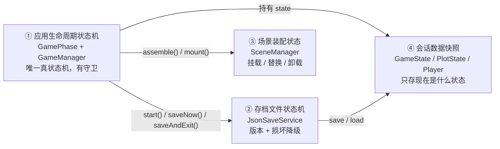
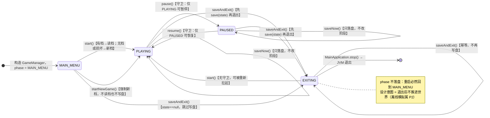
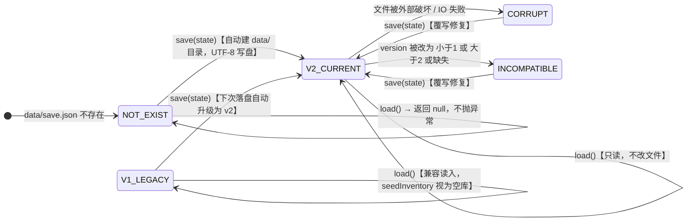
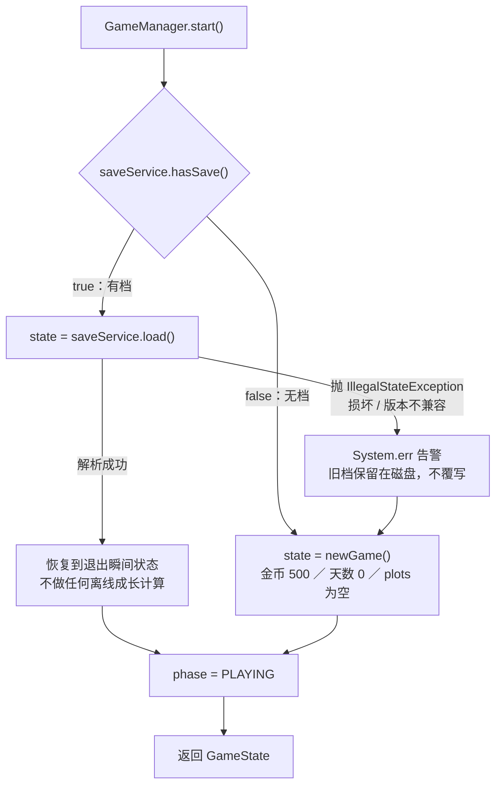
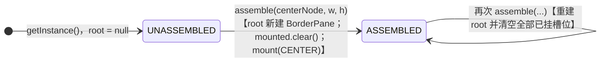
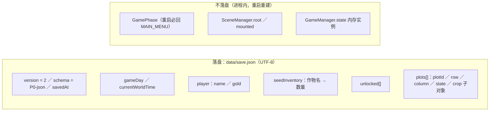

# E 模块状态机图（存档与引擎 · P0）

> 本文所有状态、转移、守卫、常量均**逐行核对源码**（GameManager / GamePhase / JsonSaveService / SceneManager / GameState / PlotState / MainApplication / MainController）后绘制，不是设计设想图。
>
> | 项目 | 值 |
> |---|---|
> | 模块 | E —— 存档与引擎（P0：GameManager、SceneManager、JsonSaveService） |
> | 核对基线 | `mvnw test` 全绿：**18 tests / 0 failures / 0 errors**（GameManagerTest 8 + JsonSaveServiceTest 10） |
> | 图源格式 | Mermaid（GitHub/GitLab 原生渲染；VS Code 需装 Markdown Preview Mermaid Support）+ PlantUML（`docs/uml/*.puml`，可导出 PNG/SVG） |

---

## 0. 总览：E 模块的状态设计共 4 处

| # | 状态设计 | 载体 | 有状态转移？ | 有守卫？ |
|---|---|---|---|---|
| ① | 应用生命周期 | `GamePhase`（4 态）+ `GameManager` | 有 | 有（`pause`/`resume`/`saveNow`） |
| ② | 存档文件 | `JsonSaveService` | 有（版本升级、损坏降级） | 有（版本区间校验） |
| ③ | 场景装配 | `SceneManager.Slot`（5 槽）+ `mounted` | 弱（挂载/替换/卸载） | 无 |
| ④ | 会话数据 | `GameState` / `PlotState` / `Player` | 纯快照 | 无（`addSeed` 参数校验除外） |

---

## 1. 图 ①：应用生命周期状态机（核心）

### 1.1 状态图

### 1.2 转移表（逐条对应代码）

| # | 源状态 | 触发 | 守卫（代码强制） | 副作用 | 目标 |
|---|---|---|---|---|---|
| T1 | —（新建） | `new GameManager(saveService)` | `saveService != null`（否则 NPE） | `phase = MAIN_MENU` | MAIN_MENU |
| T2 | MAIN_MENU | `start()` | 无阶段守卫 | `state == null` 时：有档→`load()`，无档或 `load()` 抛错→`newGame()`；随后 `phase = PLAYING` | PLAYING |
| T3 | MAIN_MENU | `startNewGame()` | 无 | 强制 `state = newGame()`（金币 500 / 天数 0），不读档、不写盘；`phase = PLAYING` | PLAYING |
| T4 | PLAYING | `pause()` | `requirePhase(PLAYING)` | `phase = PAUSED` | PAUSED |
| T5 | PAUSED | `resume()` | `requirePhase(PAUSED)` | `phase = PLAYING` | PLAYING |
| T6 | PLAYING | `saveAndExit()` | `state != null` | `saveService.save(state)` → `phase = EXITING` | EXITING |
| T7 | PAUSED | `saveAndExit()` | 同上 | 同上 | EXITING |
| T8 | MAIN_MENU | `saveAndExit()` | `state == null` → **跳过写盘** | 仅 `phase = EXITING`（不产生存档） | EXITING |
| T9 | EXITING | `saveAndExit()` | phase 不在 {PLAYING, PAUSED} → 跳过写盘 | 幂等，阶段不变 | EXITING |
| T10 | EXITING | `start()` | **无守卫** | `state != null` → 不再重新读档；仅 `phase = PLAYING` | PLAYING |
| T11 | 任意（`state != null`） | `saveNow()` | `state != null` | 只落盘，**不改阶段**（自环） | 不变 |

### 1.3 非法转移（抛 `IllegalStateException`，阶段保持不变）

| 触发 | 允许的源阶段 | 其他阶段的行为 |
|---|---|---|
| `pause()` | 仅 PLAYING | 抛 `仅游戏中可暂停（当前阶段: X）` |
| `resume()` | 仅 PAUSED | 抛 `仅暂停中可恢复（当前阶段: X）` |
| `currentState()` | 需 `state != null`（已 start） | 抛 `游戏尚未启动，请先调用 start()` |
| `saveNow()` | 需 `state != null` | 抛 `游戏尚未启动，无法保存` |

### 1.4 图 ① 的三个关键结论

1. **`EXITING` 是设计上的终态，但不是代码强制的终态。** `start()` 没有阶段守卫，`EXITING` 后调用 `start()` 会直接回到 `PLAYING`（T10）。若要改成严格终态，需给 `start()` 加 `requirePhase(MAIN_MENU)`。
2. **`start()` 对 `state` 幂等，而非对阶段幂等。** 只要 `state != null` 就不会重新读档 → **同一进程内「返回主菜单再读档」不生效**。需要多档位或多周目时，得重启进程或新增显式重置（如 `resetForNewSession()`）。
3. **`phase` 不落盘。** 重启后新管理器必然处于 `MAIN_MENU`（GameManagerTest 已断言），这是「退出后不推进世界」的实现方式，不是缺陷。

---

## 2. 图 ②：存档文件状态机（持久化层）

### 2.1 文件状态图

### 2.2 读 / 写行为表

| 当前文件状态 | 操作 | 条件 | 结果 |
|---|---|---|---|
| `NOT_EXIST` | `load()` | `hasSave() == false` | 返回 `null`（**不抛异常**） |
| `NOT_EXIST` | `save(state)` | `state != null` | 自动 `createDirectories` → 写 UTF-8 美化 JSON → `V2_CURRENT` |
| `NOT_EXIST` | `save(null)` | — | 抛 `IllegalArgumentException("GameState 不能为空")` |
| `V2_CURRENT` | `load()` | `version ∈ [1, 2]` | 返回 `GameState`（**只读，不改写文件**） |
| `V2_CURRENT` | `save(state)` | — | 覆写 → `V2_CURRENT`（自环） |
| `V1_LEGACY` | `load()` | `version == 1` | 返回 `GameState`，**`seedInventory` 按空库处理**（v1 无该字段） |
| `V1_LEGACY` | `save(state)` | — | 覆写为 `version = 2` → `V2_CURRENT`（读旧写新，原文件不被就地改结构） |
| `CORRUPT` | `load()` | JSON 解析失败 / IO 失败 | 抛 `IllegalStateException("存档文件损坏或无法读取: <绝对路径>")` |
| `CORRUPT` | `load()` | 解析成功但根不是 JSON 对象 | 抛 `IllegalStateException("存档文件为空或不是 JSON 对象")` |
| `INCOMPATIBLE` | `load()` | `version < 1` 或 `> 2` 或缺失（`asInt(-1)`） | 抛 `IllegalStateException("存档版本不兼容: 支持 version=1~2，实际 version=X")` |
| `CORRUPT` / `INCOMPATIBLE` | `save(state)` | — | 覆写为新档 → `V2_CURRENT`（故障自愈） |

### 2.3 版本常量（升级结构的唯一入口）

| 常量 | 值 | 含义 |
|---|---|---|
| `JsonSaveService.SAVE_VERSION` | **2** | 当前结构版本；**升级结构必须递增并同时写兼容分支** |
| `JsonSaveService.MIN_SUPPORTED_VERSION` | **1** | 低于此版本的旧档直接拒绝 |
| `JsonSaveService.SCHEMA` | `P0-json` | 格式标识，区分 P1 的 SQLite 正式存档 |
| `JsonSaveService.DEFAULT_SAVE_FILE` | `data/save.json` | 默认路径；`data/` 已被 `.gitignore` 忽略 |

> **v2 的由来（本次已修复的缺口）**：验收规范 §十八 / §四十一 / §一百四十九 要求 P0 存档必须包含**种子库存**，但原 `GameState` 缺该字段。现已补齐 `Map<String,Integer> seedInventory` 并将 `SAVE_VERSION` 从 1 递增到 **2**，同时对 `version = 1` 旧档做兼容读入（`seedInventory` 视为空库）——**否则旧档会被版本硬拦，启动时直接降级为新游戏**。

### 2.4 加载失败的降级路径（`GameManager.start()`）

> 降级策略要点：**加载失败绝不让启动崩溃**，且**不覆写坏档**——直到下一次 `saveNow()` / `saveAndExit()` 才覆盖。

---

## 3. 图 ③：场景装配状态机（SceneManager）

| Slot | 代码注释约定的归属 | P0 现状 |
|---|---|---|
| `TOP` | D 状态栏等 | 空 |
| `CENTER` | A 土地模块、主菜单等 | **已挂 `main-view.fxml`（主菜单）** |
| `LEFT` | —（未指定） | 空 |
| `RIGHT` | B 商店等 | 空 |
| `BOTTOM` | —（未指定） | 空 |

> **装配顺序陷阱**：`root == null`（未 `assemble`）时调用 `mount/unmount` **不报错**，只改 `mounted` 映射、不上屏；随后 `assemble()` 会先 `mounted.clear()` → **装配前挂的组件会被静默丢弃**。视图接入请一律「先 `assemble`，再 `mount`」。

---

## 4. 图 ④：数据状态（落盘 vs 不落盘）

**落盘字段清单（§四十一 P0 JSON 必存项）**

| JSON 路径 | 类型 | 写入方 |
|---|---|---|
| `version` / `schema` / `savedAt` | int / string / string | E（`savedAt` 为落盘时刻 `LocalDateTime`） |
| `gameDay` | long | D 时钟层（每日结算时 `setGameDay`） |
| `currentWorldTime` | string(ISO-8601) 或 `null` | D 时钟层（退出前写入，见第 6 节待接入 2） |
| `player.name` / `player.gold` | string / int | B 经济层 |
| `seedInventory.<作物名>` | int | B / A 适配层（`addSeed` / `consumeSeed`） |
| `unlocked[]` | string 数组 | A / B（P3 解锁，P0 默认空） |
| `plots[].plotId` | string | A 适配层（为空时序列化按 `row,column` 补全） |
| `plots[].row` / `column` / `state` | int / int / string | A 适配层 |
| `plots[].crop.cropUuid` / `cropType` / `growthStage` | string | A 生长层 |
| `plots[].crop.growthProgress` | double | A 生长层（0.0~1.0） |
| `plots[].crop.plantWorldTime` | string(ISO-8601) | A 生长层 |
| `plots[].crop.manualWaterCount` / `lastManualWaterGameDay` | int / string | A / D |
| `plots[].crop` | `null` | 无作物时显式为 `null` |

> **口径未冻结项**：`state` / `cropType` / `growthStage` 目前是**自由字符串**（E 不持有 A 的枚举，避免跨模块类型依赖）。A 交付枚举后，需由适配层固定「枚举 ↔ 字符串」映射口径，否则存档取值会出现同义不同字（如 `EMPTY` / `空闲`）。

---

## 5. 状态 × 测试覆盖（18 tests 全绿）

| 测试 | 覆盖的状态转移 |
|---|---|
| `GameManagerTest.freshManagerStaysInMainMenuUntilStarted` | T1；未 start 时 `currentState()` 抛异常 |
| `GameManagerTest.startWithoutSaveCreatesNewGameWithInitialGold` | T2（无档分支） |
| `GameManagerTest.staticNewGameProvidesInitialState` | `newGame()` 初始值 |
| `GameManagerTest.pauseResumeFollowStateMachine` | T4 / T5 / T7；非法转移（MAIN_MENU 暂停、重复暂停、PLAYING 恢复） |
| `GameManagerTest.saveAndExitPersistsAndRestartRestores` | T6；重启回 MAIN_MENU；恢复到退出瞬间（金币 321 / 天数 9 / 1 块地 `TILLED`） |
| `GameManagerTest.corruptSaveFallsBackToNewGameOnStart` | 图 ② 的损坏降级路径 |
| `GameManagerTest.saveNowBeforeStartThrows` | T11 守卫 |
| `GameManagerTest.getInstanceReturnsSameSingleton` | 单例 |
| `JsonSaveServiceTest.loadReturnsNullWhenNoSaveExists` | `NOT_EXIST` + `load()` |
| `JsonSaveServiceTest.saveCreatesFileWithVersionAndSchema` | `version=2` / `schema` / `gameDay` / `player` / `seedInventory` 落盘 |
| `JsonSaveServiceTest.saveCreatesParentDirectories` | 自动建目录 |
| `JsonSaveServiceTest.roundTripPreservesPlayerDayUnlockedAndPlots` | 全字段往返 + `plotId` 空值补 `row,column` |
| `JsonSaveServiceTest.roundTripOfEmptyState` | 空快照往返 |
| `JsonSaveServiceTest.saveRejectsNullState` | `save(null)` 参数守卫 |
| `JsonSaveServiceTest.seedInventoryRoundTripAndConsume` | 种子库存往返 + `addSeed` / `consumeSeed` |
| `JsonSaveServiceTest.loadLegacyVersion1WithoutSeedInventoryStillLoads` | `V1_LEGACY` 兼容读入 |
| `JsonSaveServiceTest.loadCorruptFileThrows` | `CORRUPT` 抛异常 |
| `JsonSaveServiceTest.loadUnsupportedVersionThrows` | `INCOMPATIBLE`（version=3）抛异常 |

---

## 6. 验收映射与待接入点

### 6.1 与验收规范的对应

| 规范要求 | 实现位置 | 状态图对应 |
|---|---|---|
| §四十~§四十二 P0 JSON 存档 | `JsonSaveService` | 图 ② |
| §四十二：保存当前状态 → 记录世界时间 → 退出 | `saveAndExit()` + `MainApplication.stop()` | T6 / T7 |
| 验收标准 2：退出即保存，重启恢复到退出瞬间 | `MainApplication.stop()` 自动 `saveAndExit()` | T6 → 图 ② `V2_CURRENT` |
| §十八 / §四十一 / §一百四十九：存档含种子库存 | `GameState.seedInventory` + JSON `seedInventory` | 图 ④ `SI` |
| §四十三：至少 `JsonSaveServiceTest` | 10 个用例 | 第 5 节 |

### 6.2 待接入点（P0 已知边界，非缺陷但需协同）

| # | 事项 | 影响 | 建议 |
|---|---|---|---|
| 1 | `pause()` / `resume()` 已实现且有测试覆盖，但**无 UI 入口**（MainController 只有「开始」「保存」两个按钮） | `PAUSED` 状态目前只有测试能到达 | 主菜单/游戏界面加暂停按钮或 ESC 绑定后即生效，无需改状态机 |
| 2 | `saveAndExit()` 只做「原样落盘」，**自己不写 `currentWorldTime`** | 若无人写入，该字段落盘为 `null` | 由 D 时钟层在退出前 `state.setCurrentWorldTime(...)`；E 不越层实现时钟逻辑 |
| 3 | `start()` 无阶段守卫 | `EXITING` 后可被 `start()` 拉回 `PLAYING`（T10） | 若要严格终态，加 `requirePhase(MAIN_MENU)` |
| 4 | `start()` 对 `state` 幂等 | 同进程内换档/重读档不生效 | 需要时新增显式重置方法（如 `resetForNewSession()`） |
| 5 | `phase` 不落盘（有意设计） | 重启必回 `MAIN_MENU` | 无需处理，与「退出后不推进世界」一致 |
| 6 | 存档无校验和 / 无 `schema` 校验 | 截断但仍是合法 JSON 的文件不会被识别为损坏 | P1 迁移 SQLite 时统一解决 |
| 7 | `GameManager` 单例无 `reset()` | 测试需经构造器注入 `SaveService` 隔离 | 保持现状即可 |

---

## 7. 如何导出为图片

| 图 | 渲染方式 |
|---|---|
| 图 ① ② ③ ④ | Mermaid：GitHub / GitLab 原生渲染；VS Code 装 *Markdown Preview Mermaid Support* 后预览；亦可粘到 <https://mermaid.live> 导出 PNG/SVG |
| 图 ① ② | PlantUML 源已附：`docs/uml/e-state-machine.puml`（生命周期）、`docs/uml/e-save-state-machine.puml`（存档文件）。用 IntelliJ IDEA 内置 PlantUML 插件或 <https://plantuml.com/plantuml> 导出，产物与 `docs/uml/p0-class-diagram.png/svg` 同目录 |

---

## 附录：图中用到的类与常量

| 符号 | 位置 | 说明 |
|---|---|---|
| `GamePhase` | `manager/GamePhase.java` | `MAIN_MENU` / `PLAYING` / `PAUSED` / `EXITING` |
| `GameManager` | `manager/GameManager.java` | 单例；`INITIAL_GOLD = 500`、默认玩家名「农夫」 |
| `SceneManager` | `manager/SceneManager.java` | 单例；`Slot` 五区；`assemble` / `mount` / `unmount` / `root` |
| `JsonSaveService` | `persistence/JsonSaveService.java` | `SAVE_VERSION=2`、`MIN_SUPPORTED_VERSION=1`、`SCHEMA="P0-json"` |
| `GameState` | `model/GameState.java` | `player` / `gameDay` / `currentWorldTime` / `seedInventory` / `unlocked` / `plots` |
| `PlotState` | `model/PlotState.java` | `plotId` / `row` / `column` / `state` + 作物字段 |
| `MainApplication` | `view/MainApplication.java` | `stop()` → `GameManager.getInstance().saveAndExit()` |
| `MainController` | `controller/MainController.java` | 「开始/继续」`start()`、「手动保存」`saveNow()` |
